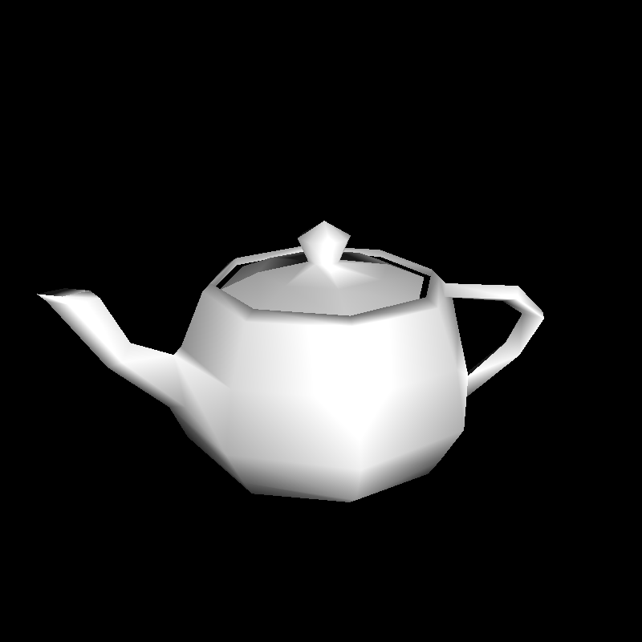

# Single-File C99 Software Renderer

<p align="center">
  
  
  
</p>

## About

I wrote `renderer.c` for my application to the [Recurse Center](https://www.recurse.com/), in response to the prompt "Please link to a program you've written from scratch." The prompt asked applicants not to use frameworks, so that it's clear the code is their own, and suggested sharing the program as a gist. The version I submitted is in [this gist](https://gist.github.com/dylan-eck/7dc273d3e89bf8319fb40d26e859a40e).

I chose to write a software renderer because I wanted to do something graphics-related, but writing graphics code typically requires an API like Vulkan or OpenGL to run code on a GPU. Software renderers, however, run entirely on the CPU, meaning I could write graphics code while still adhering to the no-frameworks request.

This repository also includes scripts I used for testing during development; see [Development scripts](#development-scripts).

## Design goals

The primary goal of this project was to create as general a renderer as possible while keeping the code small enough to fit comfortably in a gist. The finished file is about 800 lines, of which roughly 500 are code; the rest are comments and the embedded teapot data.

- **General**: Render arbitrary `.obj` models at any resolution.
- **Small but readable**: Keep code concise, without sacrificing clarity.
- **Single file**: Keep everything in one `.c` file that can be shared as a gist and compiled with a single command, with no build system.
- **No dependencies**: Use only the C99 standard library, so the renderer builds with any C99 compiler on any platform. This includes writing the output image without an image library.
- **No external data required**: Embed a model in the source so the renderer can produce an image without any input files.

Left out to keep the code small: anti-aliasing, multithreading, textures, and materials.

## Features

- Loads Wavefront `.obj` models
- Embedded Utah teapot model, so no external input required
- Camera placed automatically so the whole model is in view
- Configurable output resolution
- A complete software rendering pipeline:
  - model, view, and perspective projection transforms
  - culling of back-facing triangles and out-of-view triangles
  - fixed-point rasterization with barycentric interpolation
  - depth buffering
  - diffuse and ambient lighting with smooth shading (models without normals are shaded flat)
- Output written as a `.bmp` image, without the use of an image library

## Usage

Compile `renderer.c` with any C99 compiler:

```sh
cc -std=c99 -O2 renderer.c -o renderer -lm
```

Or use the build script, which picks an available compiler and writes the executable to `bin/`:

```sh
python3 scripts/build.py
```

See the header comment in `renderer.c` for Windows (MSVC) instructions.

Then run it:

```sh
./renderer [path/to/model.obj] [width [height]]
```

All arguments are optional. With no model, the embedded Utah teapot is rendered. The default resolution is 800×800, and if only a width is given the image is square. The result is written to `out.bmp` in the current directory.

```sh
./renderer                              # teapot at 800x800
./renderer 1920 1080                    # teapot at 1920x1080
./renderer path/to/model.obj 2048       # model at 2048x2048
```

Running `./renderer` with no arguments produces this image of the embedded teapot:

<p align="center">
  
</p>

## Development scripts

The `scripts/` directory contains the helper scripts I used while developing the renderer. I cleaned them up and committed them after submitting my application, which is why they appear late in the history. They need Python 3.8 or newer and use only the standard library.

| Script                                   | What it does                                                                                                                                                                                       |
| ---------------------------------------- | -------------------------------------------------------------------------------------------------------------------------------------------------------------------------------------------------- |
| `build.py`                               | Compiles `renderer.c` into `bin/`, skipping the build if the executable is already up to date. Uses `$CC` if set, otherwise the first of `cc`, `gcc`, `clang`, or `cl` it finds.                   |
| `fetch_test_models.py`                   | Downloads a set of test models from [common-3d-test-models](https://github.com/alecjacobson/common-3d-test-models) into `test/models/`, skipping any already downloaded.                           |
| `render_test_models.py [width [height]]` | Builds the renderer, fetches the test models, and renders each one into `test/images/`. Takes the same size arguments and defaults as the renderer.                                                |
| `gen_teapot_str.py [model.obj]`          | Converts an `.obj` file into the C string embedded at the end of `renderer.c`, rounding values to keep it small. Defaults to `assets/teapot_min.obj`. Run `clang-format` on the result to wrap it. |

## How it works

### Loading the model

[`parse_obj_str`](renderer.c#L328-L420) is a small hand-written parser for the OBJ format, used for both `.obj` files and the embedded teapot. It reads vertex positions, normals, and faces, and ignores everything else. OBJ faces can have any number of sides, so each face is split into a fan of triangles that all share the face's first vertex. This works for the convex faces most models use.

Rather than storing an index buffer, the parser copies each triangle's full vertex data into a flat array, three vertices per triangle. Vertices shared between triangles are duplicated, which uses more memory, but it keeps both parsing and rendering simple: the renderer just walks the array three vertices at a time. If the file has no normals, each triangle is given a face normal computed from the cross product of two of its edges, which is why those models are shaded flat.

### The embedded teapot

The teapot is symmetric, so to keep `renderer.c` short, the [embedded model data](renderer.c#L718-L790) only contains one half of it, with values rounded to two significant figures by [`gen_teapot_str.py`](#development-scripts). At startup, the half is [reflected](renderer.c#L629-L651) across the xy-plane to produce the other half. Mirroring reverses each triangle's winding order, which would cause back-face culling to discard the new half, so two vertices of each mirrored triangle are swapped to restore it.

### Framing the model

The camera always looks at the origin from a fixed direction, so framing the model comes down to [centering it and choosing the camera distance](renderer.c#L654-L684). The model is centered by translating all of its vertices so that their average position sits at the origin. This is simple, but it can leave models with uneven vertex density off-center (see [Limitations](#limitations)).

To choose the distance, the renderer finds the radius _r_ of a sphere around the origin that contains every vertex. It then uses the narrower of the horizontal and vertical fields of view, which depends on the output's aspect ratio, to place the camera just far enough away to fit that sphere: _d_ = 1.1 × _r_ / sin(fov / 2), where the 1.1 adds a 10% margin.

### Transforms

Each vertex is moved from model space to the screen by a single 4×4 matrix, built from the three standard ones [in `main`](renderer.c#L686-L690). The model matrix is the identity, since the vertices were already moved into place while framing the model. The view matrix, from [`mat4_look_at`](renderer.c#L269-L282), moves the world so the camera sits at the origin looking down the z-axis. The perspective matrix, from [`mat4_perspective`](renderer.c#L284-L291), uses a 45° vertical field of view and maps depth to the range 0 to 1. [`render`](renderer.c#L434-L435) multiplies the three together once, so each vertex only needs a single matrix-vector multiply.

The result is a position in clip space. [Dividing by _w_](renderer.c#L464-L468) (the perspective divide) is what makes distant geometry smaller. The x and y results are then mapped from −1…1 to 0…1, and later scaled by the image size to get pixel coordinates.

### Culling

Two kinds of triangles are skipped before rasterization. Triangles outside the view are detected in clip space, before the perspective divide: a vertex is inside the view volume when its x, y, and z coordinates all lie between −_w_ and _w_, and a triangle is [skipped](renderer.c#L470) when [all three of its vertices](renderer.c#L451-L456) are outside. This check is cheap but not exact (see [Known bugs](#known-bugs)). Triangles that are only partly in view are still drawn, and the parts outside the image are cut off when their bounding box is clamped during rasterization.

Back-facing triangles are [skipped](renderer.c#L476) based on the sign of their area on screen. Front faces are wound consistently, so a triangle whose vertices appear in the opposite order on screen is facing away from the camera, and on a closed model it would be hidden behind the front anyway. This roughly halves the number of triangles that need to be rasterized.

### Rasterization

Each remaining triangle is drawn by testing every pixel in its [bounding box](renderer.c#L478-L481), clamped to the image. For each pixel center, [`fix_signed_area`](renderer.c#L201-L206) computes the signed areas of the three triangles formed by the pixel and each edge of the triangle. If all three are non-negative, the pixel is inside the triangle. The same three areas, divided by their sum, are the pixel's barycentric weights, which say how much each vertex contributes to that pixel and are used to interpolate depth and normals.

Before these tests, screen positions are [converted to fixed point](renderer.c#L472-L474) with 8 fractional bits, or 1/256 of a pixel. Integer math makes the edge tests exact, so two triangles that share an edge never both miss a pixel along it. With floating point, rounding errors can leave single-pixel gaps between triangles. The areas are recalculated from scratch at every pixel rather than updated incrementally as the loop steps across a row. This is slower, but it's simpler to implement and fast enough for this program.

### Depth test and shading

Each pixel's depth is [interpolated](renderer.c#L504-L511) from the three vertices' depths using the barycentric weights, and compared with the depth buffer, which starts at 1 (the far plane) everywhere. If the new depth is smaller, the pixel is closer than anything drawn there so far, so its depth is stored and it is shaded. Otherwise it's skipped. Depth after the perspective divide varies linearly across the screen, so interpolating it this way is exact.

[Shading](renderer.c#L513-L532) uses Lambertian diffuse lighting with a single directional light. A pixel's brightness is the dot product of its normal and the light direction, clamped at 0 so surfaces facing away from the light don't go negative, plus a constant ambient term of 0.1 so those surfaces aren't completely black. The normal is interpolated from the vertex normals with the same barycentric weights, which gives smooth shading across triangles. This interpolation is approximate (see [Limitations](#limitations)).

### Writing the image

[`write_bmp_image`](renderer.c#L548-L586) writes the rendered image to a `.bmp` file without using an image library. It builds the 54-byte BMP header by hand, writing multi-byte fields in little-endian order as the format requires, then writes the pixel buffer straight after it. BMP stores rows bottom to top by default, so the height is written as a negative number to match the renderer's top-to-bottom pixel buffer.

## Limitations

- **Fixed camera direction and lighting.** The camera distance is chosen automatically, but the viewing angle and the single white directional light are hard-coded in `main()`. Output is always grayscale.
- **Off-center framing.** Models are centered on the average of their vertices rather than their bounding box, so meshes with uneven vertex density can sit off-center (see the beetle above).
- **Only geometry and normals are used.** Materials, texture coordinates, and vertex colors in `.obj` files are ignored.
- **No near-plane clipping.** Triangles that cross behind the camera aren't clipped. Because the camera is placed outside the model, this doesn't come up in practice.
- **Approximate shading.** Normals are interpolated in screen space rather than with perspective correction, and aren't renormalized after interpolation, which slightly darkens shading between vertices.

## Known bugs

- **Negative face indices read out of bounds.** Relative indices like `f -3 -2 -1` are valid in the OBJ format but aren't supported, and indices outside the vertex list aren't checked either.
- **Very large resolutions overflow.** The image size is computed with 32-bit integers, so resolutions above roughly 46,000 × 46,000 overflow before the buffers are allocated. The existing size check can never trigger.
- **Invalid size arguments are ignored.** A width or height that isn't a number (e.g. `./renderer model.obj abc`) silently falls back to the default instead of giving an error.
- **Partial normals aren't handled.** Normals are only generated when a model has none at all. If a model provides normals for some faces but not others, the faces without them are shaded using uninitialized data.
- **Out-of-view test uses the wrong depth range.** The perspective matrix maps depth to 0…1, but the out-of-view test accepts clip-space z between −_w_ and _w_, the range for OpenGL-style −1…1 depth. Vertices slightly closer than the near plane are treated as in view. The camera is always placed outside the model, so this has no visible effect.
- **Out-of-view culling can drop visible triangles.** A triangle is skipped if all three of its vertices are off-screen, even when it spans the view. The automatic camera placement means this doesn't happen when rendering a whole model.

## Credits

- Utah teapot model: [University of Utah](https://graphics.cs.utah.edu/teapot/)
- Test models: [alecjacobson/common-3d-test-models](https://github.com/alecjacobson/common-3d-test-models)
